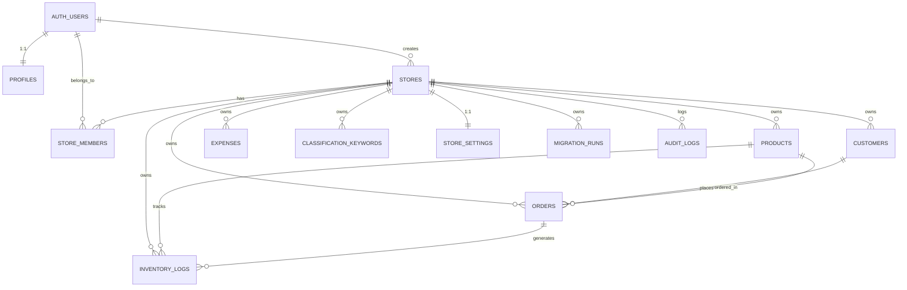

# Supabase 데이터베이스 관계 문서

> 본 문서는 2-2단계 제약조건, 인덱스, 트리거, helper 함수를 기반으로 작성한다.
> 개인정보는 포함하지 않는다.

## 1. 엔티티 관계 다이어그램 (Mermaid)

## 2. 외래키 관계 상세

### 2.1 auth.users → profiles
| 속성 | 값 |
|---|---|
| 참조 방향 | profiles.id → auth.users(id) |
| 삭제 정책 | ON DELETE CASCADE |
| 이유 | 사용자 삭제 시 프로필도 함께 제거 |

### 2.2 auth.users → stores
| 속성 | 값 |
|---|---|
| 참조 방향 | stores.created_by → auth.users(id) |
| 삭제 정책 | NO ACTION (nullable) |
| 이유 | 생성자가 삭제돼도 매장은 유지 |

### 2.3 stores → store_members
| 속성 | 값 |
|---|---|
| 참조 방향 | store_members.store_id → stores(id) |
| 삭제 정책 | NO ACTION |
| 이유 | 매장 삭제 전 멤버십 정리 필요. CASCADE 시 멤버 기록 유실 |

### 2.4 auth.users → store_members
| 속성 | 값 |
|---|---|
| 참조 방향 | store_members.user_id → auth.users(id) |
| 삭제 정책 | NO ACTION |
| 이유 | 사용자 삭제 시 멤버십 기록 보존 여부는 비즈니스 결정 사항 |

### 2.5 stores → products
| 속성 | 값 |
|---|---|
| 참조 방향 | products.store_id → stores(id) |
| 삭제 정책 | NO ACTION |
| 이유 | 매장 삭제 시 상품/주문/재고 기록을 cascade로 제거하면 영업 기록 유실. soft delete 우선 |

### 2.6 stores → customers
| 속성 | 값 |
|---|---|
| 참조 방향 | customers.store_id → stores(id) |
| 삭제 정책 | NO ACTION |
| 이유 | 고객과 주문 이력 보존 필요 |

### 2.7 stores → orders
| 속성 | 값 |
|---|---|
| 참조 방향 | orders.store_id → stores(id) |
| 삭제 정책 | NO ACTION |
| 이유 | 주문 이력은 매장보다 오래 보존할 수 있음 |

### 2.8 customers → orders
| 속성 | 값 |
|---|---|
| 참조 방향 | orders.customer_id → customers(id) |
| 삭제 정책 | NO ACTION |
| 이유 | 고객 soft delete 시에도 주문 이력 보존. 과거 매출 분석에 필요 |
| nullable | ✅ 예 — 기존 주문 이관 시 고객 매칭 실패 가능 |

### 2.9 products → orders
| 속성 | 값 |
|---|---|
| 참조 방향 | orders.product_id → products(id) |
| 삭제 정책 | NO ACTION |
| 이유 | 상품 soft delete 시에도 주문 이력 보존. 원가 스냅샷으로 과거 수익 유지 |
| nullable | ✅ 예 — 기존 주문 이관 시 상품 매칭 실패 가능 |

### 2.10 products → inventory_logs
| 속성 | 값 |
|---|---|
| 참조 방향 | inventory_logs.product_id → products(id) |
| 삭제 정책 | NO ACTION |
| 이유 | 상품 삭제 시에도 재고 이력 보존 |
| nullable | ✅ 예 — 마이그레이션 시 미매핑 가능 |

### 2.11 orders → inventory_logs
| 속성 | 값 |
|---|---|
| 참조 방향 | inventory_logs.order_id → orders(id) |
| 삭제 정책 | NO ACTION |
| 이유 | 주문 삭제 시에도 재고 이력 보존 (audit 목적) |
| nullable | ✅ 예 — 수동 재고 조정 시 주문 없음 |

### 2.12 stores → expenses
| 속성 | 값 |
|---|---|
| 참조 방향 | expenses.store_id → stores(id) |
| 삭제 정책 | NO ACTION |

### 2.13 stores → classification_keywords
| 속성 | 값 |
|---|---|
| 참조 방향 | classification_keywords.store_id → stores(id) |
| 삭제 정책 | NO ACTION |

### 2.14 stores → store_settings
| 속성 | 값 |
|---|---|
| 참조 방향 | store_settings.store_id → stores(id) |
| 삭제 정책 | NO ACTION |
| unique | ✅ store_settings.store_id UNIQUE |

### 2.15 stores → migration_runs
| 속성 | 값 |
|---|---|
| 참조 방향 | migration_runs.store_id → stores(id) |
| 삭제 정책 | NO ACTION |

## 3. ON DELETE CASCADE를 사용하지 않은 이유

| 테이블 | CASCADE 안 한 이유 |
|---|---|
| stores 하위 전체 | 매장 삭제가 상품/주문/고객/재고 기록을 cascade로 지우면 영업 기록 영구 유실. soft delete + 수동 정리 권장 |
| customers → orders | 고객 soft delete 시에도 과거 주문과 매출 이력 보존 필요 |
| products → orders | 상품 soft delete 시에도 과거 주문의 원가 스냅샷과 수익 이력 보존 필요 |
| products → inventory_logs | 재고 이력은 상품보다 오래 보존해야 할 수 있음 (audit) |
| orders → inventory_logs | 주문 취소/삭제 시에도 재고 변경 이력 보존 (append-only) |

## 4. soft delete 방식

| 테이블 | deleted_at | 적용 여부 | 복원 가능 |
|---|---|---|---|
| stores | ✅ | 예 | 예 |
| products | ✅ | 예 | 예 |
| customers | ✅ | 예 | 예 |
| orders | ✅ | 예 | 예 |
| expenses | ✅ | 예 | 예 |
| classification_keywords | ✅ | 예 | 예 |
| store_settings | ❌ | 아니오 | 해당 없음 |
| store_members | ❌ | 아니오 | is_active로 대체 |
| profiles | ❌ | 아니오 | 해당 없음 |
| inventory_logs | ❌ | 아니오 | append-only |
| audit_logs | ❌ | 아니오 | append-only |
| migration_runs | ❌ | 아니오 | 상태 트래킹용 |

## 5. 같은 store 검증 방식

### 5.1 composite unique (store_id, id)

다음 테이블에 `unique(store_id, id)`를 추가하여 composite FK의 기반을 마련:

- customers
- products
- orders

`id`가 이미 PK(고유)이므로 `(store_id, id)`도 자동으로 고유. PostgreSQL composite FK를 위해 명시적 unique constraint 필요.

### 5.2 trigger 기반 cross-store 검증

nullable 외래키(customer_id, product_id, order_id)가 있는 테이블에서는 trigger를 사용:

| 테이블 | 검증 내용 | 방식 |
|---|---|---|
| orders | customer_id가 같은 store의 customers에 속하는지 | BEFORE INSERT/UPDATE trigger |
| orders | product_id가 같은 store의 products에 속하는지 | BEFORE INSERT/UPDATE trigger |
| inventory_logs | product_id가 같은 store의 products에 속하는지 | BEFORE INSERT/UPDATE trigger |
| inventory_logs | order_id가 같은 store의 orders에 속하는지 | BEFORE INSERT/UPDATE trigger |

trigger 함수는 `SECURITY DEFINER` + `SET search_path = ''`로 실행되어 RLS와 search_path 공격으로부터 보호.

### 5.3 composite foreign key vs trigger 비교

| 방식 | 장점 | 단점 | 사용 위치 |
|---|---|---|---|
| composite FK | 선언적, DB가 자동 검증 | nullable 컬럼에서는 NULL 시 검증 스킵됨 | non-nullable 관계 (store_id만) |
| trigger | nullable 컬럼 처리 가능, 커스텀 오류 메시지 | 절차적, 유지보수 필요 | nullable 관계 (customer_id, product_id, order_id) |

## 6. nullable legacy 관계

| 테이블 | nullable FK | 이유 |
|---|---|---|
| orders | customer_id | 기존 주문 이관 시 고객 매칭 실패 가능 |
| orders | product_id | 기존 주문 이관 시 상품 매칭 실패 가능 |
| inventory_logs | product_id | 마이그레이션 시 미매핑 가능 |
| inventory_logs | order_id | 수동 재고 조정 시 주문 없음 |

이들 관계는 trigger가 아닌 단순 FK로는 완전한 store 일치를 보장할 수 없으므로 trigger 기반 검증을 병행.

## 7. partial unique index 정책

| 인덱스 | 대상 | 조건 | 이유 |
|---|---|---|---|
| unique_products_active_store_code | 활성 상품 | deleted_at IS NULL | 삭제된 상품의 코드는 재사용 가능 |
| unique_products_legacy_id | 전체 상품 | legacy_id IS NOT NULL | 마이그레이션 재실행 시 soft-deleted 데이터와도 충돌 방지 |
| unique_customers_legacy_id | 전체 고객 | legacy_id IS NOT NULL | 마이그레이션 재실행 시 soft-deleted 데이터와도 충돌 방지 |
| unique_orders_active_store_number | 활성 주문 | deleted_at IS NULL | 삭제된 주문 번호는 재사용 가능 |
| unique_orders_legacy_id | 전체 주문 | legacy_id IS NOT NULL | 마이그레이션 재실행 시 soft-deleted 데이터와도 충돌 방지 |
| unique_keywords_active_store_type_standard | 활성 키워드 | deleted_at IS NULL | 삭제된 키워드는 재생성 가능 |

## 8. 예약 재고(reserved_stock) 제약 미적용 이유

`products` 테이블에 `reserved_stock <= current_stock` CHECK 제약을 **적용하지 않음**.

이유:
1. 기존 앱에서 주문 생성(submitAdd) 시 `reserved_stock += quantity`만 수행하고 current_stock 초과 여부를 검증하지 않음
2. 동시 다발 주문 시 reserved_stock이 current_stock을 초과할 수 있는 구조
3. 마이그레이션 데이터에서 이미 초과 예약된 상품이 존재할 가능성
4. 이 제약은 애플리케이션 로직(주문 가능 여부 확인)에서 처리하는 것이 적절

## 9. 제약조건 요약

| 테이블 | 제약조건 유형 | 개수 |
|---|---|---|
| store_members | UNIQUE | 1 |
| products | CHECK | 7 |
| products | UNIQUE (composite) | 1 |
| customers | CHECK | 4 |
| customers | UNIQUE (composite) | 1 |
| orders | CHECK | 4 |
| orders | UNIQUE (composite) | 1 |
| expenses | CHECK | 1 |
| classification_keywords | CHECK | 1 |
| store_settings | UNIQUE | 1 |
| store_settings | CHECK | 5 |
| migration_runs | CHECK | 10 |

## 10. 인덱스 요약

| 테이블 | 인덱스 수 | 주요 인덱스 |
|---|---|---|
| store_members | 4 | user_id, store_id, store_id+role, is_active |
| products | 6 | store_id, store_id+brand, store_id+category, store_id+stock_year+month, store_id+deleted_at, updated_at |
| customers | 6 | store_id, store_id+lower(name), phone, wechat_nickname, deleted_at, updated_at |
| orders | 9 | store_id, customer_id, product_id, status, order_date, ship_date, store_id+status+order_date, deleted_at, updated_at |
| inventory_logs | 5 | store_id, product_id, order_id, created_at, change_type |
| expenses | 4 | store_id, expense_date, category, deleted_at |
| classification_keywords | 5 | store_id, classification_type, priority, is_active, deleted_at |
| audit_logs | 5 | store_id, table_name, record_id, changed_at, changed_by |
| migration_runs | 4 | store_id, status, source_fingerprint, created_at |

## 11. trigger 적용 테이블

### updated_at/version trigger (handle_updated_at_and_version)

| 테이블 | version 증가 | store_id 변경 차단 |
|---|---|---|
| profiles | ❌ | 해당 없음 |
| stores | ✅ | ✅ |
| store_members | ✅ | ✅ |
| products | ✅ | ✅ |
| customers | ✅ | ✅ |
| orders | ✅ | ✅ |
| expenses | ✅ | ✅ |
| classification_keywords | ✅ | ✅ |
| store_settings | ✅ | ✅ |
| migration_runs | ✅ | ✅ |

### cross-store validation trigger

| 테이블 | 검증 대상 |
|---|---|
| orders | customer_id → customers, product_id → products |
| inventory_logs | product_id → products, order_id → orders |

## 12. private helper 함수

| 함수 | 반환 | 설명 |
|---|---|---|
| private.is_store_member(uuid) | boolean | 현재 사용자가 해당 store의 active 멤버인지 |
| private.current_store_role(uuid) | member_role / null | 현재 사용자의 해당 store 내 역할 |
| private.has_store_role(uuid, member_role[]) | boolean | 현재 사용자가 지정된 역할 중 하나인지 |

### 보안 설정

- `SECURITY DEFINER` + `SET search_path = ''` 적용
- `PUBLIC`에게 `REVOKE ALL`
- `authenticated`에게만 `GRANT EXECUTE`
- `auth.uid()` 기반으로 다른 사용자 ID를 파라미터로 받지 않음
- store_members RLS 정책 낭에서 호출핏도 무한 재귀 방지 (RLS bypass)